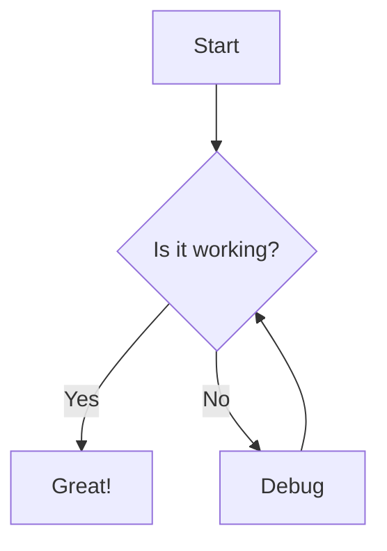
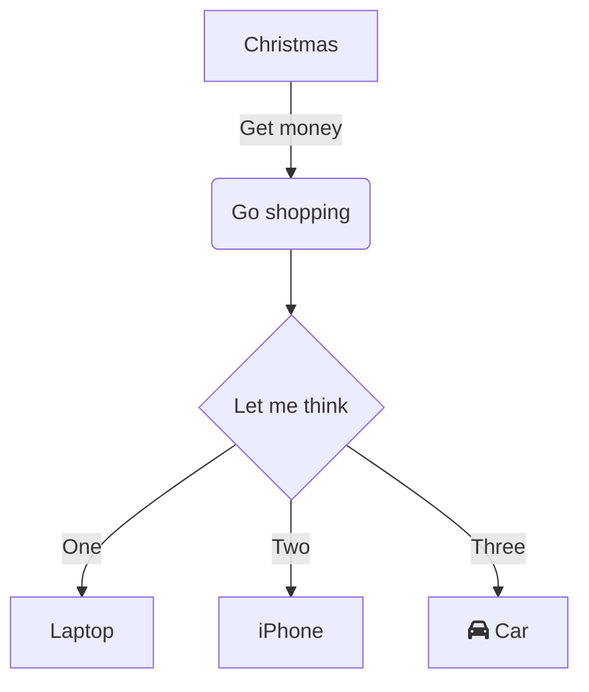

# Sample Markdown with Mermaid Diagrams

This is a test file with multiple Mermaid diagrams in different formats.

## Basic Diagram





## Complex Diagram





## Alternative Syntax


```{.mermaid}
sequenceDiagram
    Alice->>John: Hello John, how are you?
    John-->>Alice: Great!
    Alice-)John: See you later!
```

